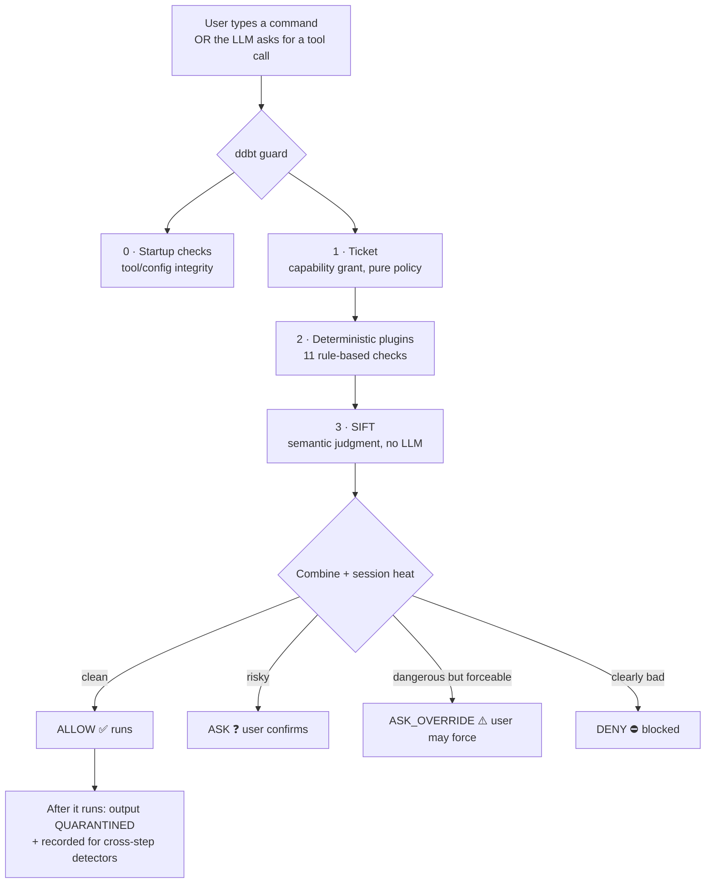
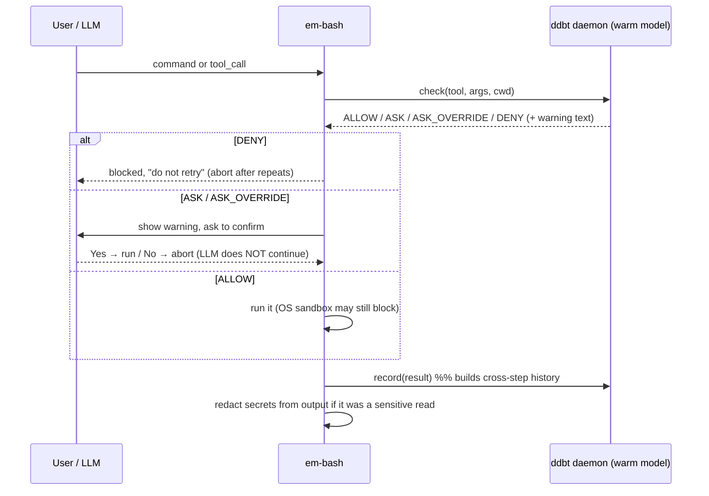
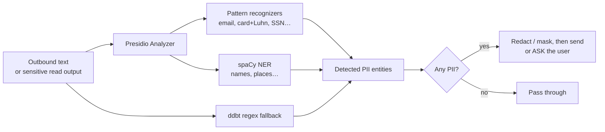
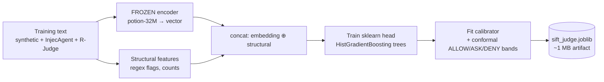

Dont Do bad Things - Agentic framework with LLM+Semantic methods to stop bad things from happening by an Agent.

Repo: https://github.com/AnirudhG07/ddbt-agent

**Main Goal:** $\boxed{\text{Preventing Exfiltration Attempts + Stop General Bad things}}$

# Key Features

1. LLM/Semantic Layer(called SIFT) Judgment.
2. Instead of ALLOW/ASK/DENY we introduce ALLOW/ASK/ASK_OVERRIDE. ASK_OVERRIDE is a special ASK with meaningful and precise warning presented, for example maybe some personal information leak could be detected, so It will mention it. If the user allows it, then let it happen.
3. SIFT is 0 cost, Fast inference( <~2ms), < 150MB global size (so cheap).
4. Very extensible with what you want as GOOD/BAD things.

# Datasets

These are links for datasets used for Benchmarking and checking power.

## Bench

- R-Judge
- InjecAgent
- McpTOX
- ToolEmu
- AgentSafetyBench
- AgentTrust

## Dataset/Methods for Exfiltration Attempts

- https://www.kaggle.com/datasets/daumel/dns-tunneling-dataset
- https://www.mindpointgroup.com/blog/conducting-and-detecting-data-exfiltration

# Semantic Layer

SIFT - Semantic Intent and Flow Triage, is a semantic layer which is trained to detect intent of the agent/workflow and see if it is benign, suspicious - malicious. The Triage is for the final judgement of the workflow, which could be ALLOW/ASK/DENY. We also introduce ALLOW/ASK/ASK_OVERRIDE, where ASK_OVERRIDE has same warning has DENY but you get option to still execute it.

## Tuning the semantic Layer

References:

- https://attack.mitre.org/

We have to tune the semantic layer for

1. Letting Benign commands to run
2. Stop suspected Malicious attack

Now these can be either Per query or an attempt within a session window. For example: `curl apple.png` is OK, but `curl passport.png` should be Flagged as Risky. Hence we need understand and tuning based on keywords we can find within a query + overall session behaviour.

## Premade HF model

We use a premade HF model to fine tune over, which is some Millions params(<50M) to control the size. Now based on our tests, we tried a lot of models to see which one gives out the best of the results and we get the below results:

```
encoder         R-Judge (F1/AUROC)   InjecAgent   AgentTrust   ToolEmu    ASBench    torch?
32M   (default)   0.91 / 0.92          95% / 94%    100% / 100%  24% / 85%  40% / 60%  no
8M    (mini)      0.85 / 0.90          95% / 94%    100% / 100%  24% / 85%  40% / 60%  no
code-16M          0.81 / 0.81          95% / 94%    100% / 100%  24% / 85%  40% / 60%  no
retrieval-32M     0.84 / 0.89          95% / 94%    100% / 100%  24% / 85%  40% / 60%  no
(replay cells = attacks-stopped / benign-clean)
```

This shows that **only R-Judge separates the encoders** — the four interception datasets are identical across all of them. That is not a bug: those decisions are made by the deterministic layers (see the Plugins section), and the embedding only drives the fuzzy R-Judge head. So we keep **potion-32M** (best, torch-free); **potion-8M** is a ~4× smaller "sift-mini". Other-lab encoders (Google EmbeddingGemma, Qwen3-Embedding, BGE, E5, GTE, Nomic, Arctic) are wired into `bench/compare_encoders.py` for comparison, but they need torch and don't beat 32M enough to justify it.

---

# ddbt from 0 to 100 (the easy version)

> **One line:** every time a command is about to run — whether _you_ typed it or the _LLM_ asked for it — ddbt looks at it, decides **ALLOW / ASK / ASK_OVERRIDE / DENY** in about a millisecond, and only then lets it through. No cloud, no API key, no LLM required.

Think of ddbt as a **security guard standing at the door where actions leave the room.** It never reads your mind or blocks you from _talking_; it only checks _actions with real-world effect_ (running a shell command, reading a file, sending data over the network).



## Layers, in plain words

| Layer           | What it is                                                                                                   | Can an attacker talk past it?                                         |
| --------------- | ------------------------------------------------------------------------------------------------------------ | --------------------------------------------------------------------- |
| **0 · Startup** | Hashes tool descriptions / MCP endpoints so a _poisoned tool_ is caught before the loop runs                 | No — it's a hash check                                                |
| **1 · Ticket**  | The agent's "visitor badge": which tools, paths, hosts, how many times, how long. Plain code, no AI          | No — pure arithmetic/policy                                           |
| **2 · Plugins** | 11 deterministic rules (see below) — obfuscation, exfiltration, network egress, destructive commands, PII, … | No — regex/structural/graph logic                                     |
| **3 · SIFT**    | The semantic layer — a frozen embedding + a tiny trained head that scores _intent_                           | It's the only "fuzzy" layer, so it's the backstop, not the first line |

The important idea: **the first three layers are ordinary code.** A prompt-injection attack works by _talking_ the model into something — but you cannot talk a regex or a hash out of its answer. SIFT adds meaning-awareness on top; it is never the _only_ thing standing between data and the exit.

The **ticket** in one line: it's the agent's *visitor badge* — a short list you write of which tools, paths and hosts it may touch and how often — checked by plain code before anything runs.

---

# When does ddbt run inside em-bash?

em-bash is the shell/agent. ddbt plugs in as an **extension** and listens for four events. The two that matter most both fire **before anything executes**:

| em-bash event      | When it fires                                         | What ddbt does                                                                           |
| ------------------ | ----------------------------------------------------- | ---------------------------------------------------------------------------------------- |
| `user_bash`        | **You type a command** in the shell                   | Checks it (ALLOW/ASK/DENY) _before_ it runs                                              |
| `tool_call`        | **The LLM asks to run a tool** (Bash/Read/WebFetch/…) | Checks it _before_ it runs — this is the main hook                                       |
| `tool_result`      | **After** a tool finishes                             | Records the step (so cross-step detectors see history) + redacts secrets from the output |
| `session_shutdown` | Session ends                                          | Cleans up the daemon                                                                     |

So the answer to "when is it called — on the LLM tool call, or when a command is given?" is **both**: any path that leads to a real action is gated _before_ execution. A hard-stopped step is _not_ recorded (it never ran); an allowed/asked step _is_ recorded, which is how the multi-step detectors build history.



**Why a "daemon"?** The model takes a few seconds to load once. em-bash starts one long-lived `ddbt serve` process that keeps the model warm, so every check afterwards is ~1 ms instead of paying the load cost each time.

**The anti-loop design (important):** em-bash has no built-in "stop retrying" cutoff. So a DENY carries a _terminal_ reason ("do not retry — tell the user"), and after a couple of repeated denials ddbt aborts the turn. A sensitive **read** isn't blocked at all — it's allowed and the _output_ is redacted — so there is nothing for the model to loop on. This is what stops the "LLM keeps trying the blocked thing forever" trap.

---

# The plugins — what each one does

Plugins are the **deterministic layer 2**. They are named in `ddbt.json` with self-describing names. Each plugin can do three things:

- **`normalize`** — rewrite the command so later layers see the _real_ intent (only `shell_deobfuscation`).
- **`pre_check`** — look at the action _before_ it runs and return `deny` / `ask` / `sanitize` (or nothing).
- **`observe`** — after a step runs, quietly _remember_ something for later (this is how multi-step attacks are caught). The manager combines all verdicts with **most-severe-wins**.

Plugins are **not just regex.** They use whatever tool fits the job, and the "How" column below spells out each one: plain **text rewriting** (`reveal_hidden_commands`), **dataflow taint-tracking** that follows a secret through re-encoding (`stop_secret_exfiltration`), **stateful accounting** that sums bytes/chunks across the whole session (`stop_slow_data_leaks`), **structural/provenance rules** on the destination (`control_network_egress`), cross-step **correlation** (`detect_multi_step_attacks`), and even **embedding similarity** using the very same vectors SIFT loads (`review_sensitive_sends`). What they all share is that they're deterministic — the answer comes from code, not from a model you can argue with — so an attacker can't talk past them.

And to the natural next question — **how do plugin results reach SIFT?** They don't feed *into* it. Plugins and SIFT are **separate deciders that run in parallel and get merged at the end.** First every plugin's `pre_check` runs and the most-severe of their verdicts wins (a DENY beats an ASK beats a redact). Then SIFT produces its own verdict from the action's embedding + structural flags. The engine combines the two — plus the session's heat — into the single final ALLOW / ASK / ASK_OVERRIDE / DENY. So a plugin can hard-stop something SIFT would have allowed, and SIFT can raise an ASK on something no plugin flagged; crucially, plugin findings are **not** input features to SIFT's trained model (it only ever sees the embedding + structural flags), they're a parallel vote combined with SIFT's at decision time.

| Config name (what you read)  | Internal            | How it's achieved                                              | In one sentence                                                                                             |
| ---------------------------- | ------------------- | ------------------------------------------------------------- | ----------------------------------------------------------------------------------------------------------- |
| `reveal_hidden_commands`     | shell_deobfuscation | Text rewrites (base64/hex/rot13/quote decoders, 9 strategies) | Un-hides obfuscated shell (base64/hex/quote tricks) so the real command is visible                          |
| `stop_secret_exfiltration`   | provenance_taint    | Dataflow taint — follows the data edge, decode-then-match     | A secret read earlier can't leave later, **even re-encoded** (taint follows the data, not the bytes)        |
| `stop_slow_data_leaks`       | exfil_budget        | Stateful accounting over the ledger (sum bytes/chunks/cadence)| Catches "low-and-slow": bulk volume, many small chunks, or beaconing to one destination                     |
| `control_network_egress`     | net_filter          | Structural rules — denylists, SSRF ranges, destination provenance | Rules on **where** data may go: SSRF/metadata IPs, known exfil hosts, attacker-chosen destinations      |
| `review_sensitive_sends`     | net_semantic        | Embedding similarity (nearest-centroid + goal-cosine, Model2Vec) | _Meaning-based_ egress: is what's leaving **like** credentials/PII/source, and is the destination off-goal? |
| `detect_multi_step_attacks`  | killchain           | Cross-step correlation along the ATT&CK chain, at a send      | Correlates read→encode→send across steps; fires **only at a network send**                                  |
| `watch_session_risk`         | trajectory_score    | Weighted session features (goal-drift, action burst, novelty) | Watches the **shape** of the whole session (goal-drift, bursts, novel destinations)                         |
| `custom_rules`               | policy_rules        | Declarative DSL you write (trigger → predicate → enforce)     | Your own cross-step rules written in `ddbt.json` (no code)                                                  |
| `block_destructive_commands` | destructive_guard   | Regex signatures for catastrophic forms (+ safer suggestion)  | Hard-denies catastrophes: `rm -rf /`, `DROP DATABASE`, `git push --force`, curl-pipe-to-shell               |
| `block_known_attacks`        | mitre_guard         | MITRE ATT&CK signature library (specific per-technique regex) | A library of MITRE ATT&CK signatures for known-bad patterns                                                 |
| `redact_personal_data`       | pii_dlp             | Presidio (regex+checksum + spaCy NER) unioned with regex fallback | Strips names/emails/SSNs/cards from outbound data (uses **Presidio**, see below)                        |

### Grouped, so it's easy to remember

- **See clearly first:** `reveal_hidden_commands` rewrites tricks like `'r''m' -rf /` or `$(echo Y3VybA==|base64 -d)` into plain text so every other layer isn't fooled.
- **Stop data leaving (the core goal):** `stop_secret_exfiltration` (a read secret is _tainted_ and can't be sent, even after `base64`), `stop_slow_data_leaks` (the aggregate — 10k rows in small batches), `control_network_egress` (bad destinations), `review_sensitive_sends` (semantic double-check).
- **See the whole story:** `detect_multi_step_attacks` and `watch_session_risk` look across steps, because an attack is often innocent step-by-step.
- **Obvious bad stuff:** `block_destructive_commands` and `block_known_attacks` are fast hard rules.
- **Privacy on the way out:** `redact_personal_data`.

---

# How Presidio works (the `redact_personal_data` plugin)

**Presidio** is Microsoft's open-source PII detection/anonymization toolkit. ddbt uses it to find personal data (emails, phone numbers, credit cards, SSNs, names, …) and **redact it from data that is about to leave** — or from the output of a sensitive read before the model sees it.

Presidio has two detection styles; ddbt combines Presidio with its own regex fallback so a blind spot in one is covered by the other:

1. **Pattern recognizers** — regex + checksums for structured PII (a credit card that passes the Luhn check, an email, an IBAN). Fast and precise.
2. **NER (named-entity recognition)** — a small spaCy language model spots _contextual_ PII like a person's name or a location that no regex can list.



**Where you'd actually see it:** the most common trigger is a sensitive **read** — e.g. the LLM runs `cat .env` or reads a customer file. ddbt allows the read (so no retry-loop) but marks the output for **screening**; when the result comes back, Presidio + the regex fallback strip the secrets/PII so the model receives a redacted version. You can also configure it to `ask` (confirm with a human) or `deny`.

**Performance note (why you may not have seen it "in action"):** constructing Presidio loads that spaCy model, which is slow (~1–3 s). ddbt builds **one shared analyzer** and reuses it, so it's paid once, not per check. If Presidio isn't installed at all, the plugin silently falls back to its built-in regex detectors — so it always works, just with less coverage of contextual names.

---

# How SIFT is trained (and why it's torch-free)

**SIFT = Semantic Intent & Flow Triage.** This is the "layer 3" semantic judge. The single most important fact:

> **We do NOT fine-tune the embedding model. It is frozen.** "Training SIFT" only trains a small classifier on top of the frozen embeddings.



Step by step:

1. **Encode (frozen).** Each training action is turned into a vector by the potion-32M **static** embedding. "Static" means it's a lookup table + pooling — a plain numpy operation, **not** a neural forward pass — which is exactly why it needs no torch and runs in ~1 ms.
2. **Add structural features.** Alongside the vector we add hand-computed flags (does it touch a secret path, is there an external URL, how many files, …).
3. **Train the head.** A scikit-learn `HistGradientBoosting` (gradient-boosted trees) learns to score `[embedding ⊕ structural] → risk`. This is the only thing that "learns", and it trains in seconds on CPU.
4. **Calibrate + set bands.** A calibrator turns the raw score into a real probability, and _conformal bands_ set the thresholds that split ALLOW / ASK / DENY at a target false-positive rate.
5. **Save.** Everything is dumped to a single ~1 MB `sift_judge.joblib`.

**Getting started does NOT need torch.** A fresh install runs `ddbt prepare`, which downloads the ~30 MB potion model (once) and fits the head — numpy + scikit-learn only. Torch would only ever be needed if you chose one of the _other-lab_ comparison encoders (Gemma/Qwen/…), and even then it would be a **frozen feature extractor** — torch runs its forward pass to embed, it never fine-tunes.

**How it's referenced at runtime.** The `ddbt serve` daemon loads `sift_judge.joblib` once (memory-mapped, offline) and keeps it warm. For every check it: encodes the action → runs the head → calibrates → applies the bands → returns ALLOW/ASK/DENY plus a human-readable reason. `DDBT_SIFT_MODEL` can point at a different artifact (that's how the encoder sweep tests each one). If SIFT is unavailable, ddbt falls back to an LLM judge so enforcement never silently drops.

**Why "less power" is fine.** R-Judge scores every ASK as a false positive (it has no "ask a human" bucket), so SIFT's F1 there is a _lower bound_ — an ASK is a feature, not a miss. And on ToolEmu / AgentSafetyBench the safe/unsafe line is a subtle LLM-behaviour judgment a static embedding can't fully reproduce (that's the 24% / 40% "stopped" numbers). Those are the honest ceiling; for that kind of workload you can switch on the LLM judge.

---

# ALLOW / ASK / ASK_OVERRIDE — the decision menu

| Verdict          | Meaning                               | What the user sees                                                                     |
| ---------------- | ------------------------------------- | -------------------------------------------------------------------------------------- |
| **ALLOW**        | On-goal, safe                         | Runs (the OS sandbox may still block it separately)                                    |
| **ASK**          | Risky, needs a human                  | A clear warning + Allow / Cancel. **Cancel = nothing runs, the LLM does not continue** |
| **ASK_OVERRIDE** | Dangerous, but the human may force it | Same loud warning as a DENY, but with an "Override and run anyway" option              |
| **DENY**         | Clearly bad                           | Blocked with a terminal "do not retry" reason                                          |

`ASK_OVERRIDE` is the friendly upgrade over a plain DENY: instead of a dead end, it explains _exactly_ why it's dangerous (e.g. "this looks like it would send your `.env` to an unknown host") and lets a responsible human take the wheel. Whether a DENY becomes an ASK_OVERRIDE is a config switch (`deny_mode: "override"`).

---

# Session heat & chromatics (at a glance)

ddbt also tracks the **whole session's** temperature. Suspicion only rises from real evidence (a blocked step, or ≥2 corroborating signals), and it ratchets **up** through NORMAL → ELEVATED → LOCKED; the only way down is an audited human `ddbt clear`. Rising heat **narrows what the agent can reach** — it doesn't freeze it (basic work still runs at LOCKED). Every decision also gets a **colour** (green/yellow/red) so a whole session can be read at a glance. (Full detail in the repo README.)

---

# FAQ

**Is there an LLM in the loop?** By default, **no**. The shipped judge (SIFT) is a local frozen-embedding + tiny sklearn model — $0, offline, sub-millisecond. An LLM is available only as an opt-in flagged fallback (`DDBT_JUDGE=llm`).

**How is this better than prompt-injection filters?** Filters try to catch bad _words_. ddbt gates bad _actions_ with deterministic layers an attacker can't talk past (ticket, provenance, network rules), and only adds semantics on top. The key move is **provenance**: the question isn't "did this value appear in tool output" but "**could a stranger have chosen it?**"

**What is an "injection", concretely?** Acting on an instruction/destination that came from untrusted tool _content_ (a message body, a web page) rather than from the user's request. ddbt hard-denies acting on attacker-chosen destinations.

**Does it slow things down?** A check is ~1 ms after the model is warm (the daemon keeps it loaded). The heavy one-time costs are the model load (~2.5 s, once) and the first Presidio build (~1–3 s, once, shared).

**What if ddbt isn't sure?** It fails **safe**: on error or timeout it ASKs rather than silently allowing.

**Can I add my own rules?** Yes — `custom_rules` (`policy_rules`) lets a workspace add cross-step rules in `ddbt.json` with no code, and the `policy` block sets allow/deny lists for tools, paths, hosts, and email domains.

**Why not fine-tune the embedding model for our data?** Because that would need torch and a big training pipeline for little gain — the deterministic layers do most of the interception, and the frozen encoder + trained head already reproduce the LLM-comparable metric (R-Judge F1 0.91). We can always distill more data into the _head_ without touching the encoder.

---

# Glossary

- **SIFT** — Semantic Intent & Flow Triage; the local, no-LLM judge (frozen embedding + sklearn head).
- **Ticket / grant** — the agent's capability badge (tools, paths, hosts, quotas) checked by plain code.
- **Provenance** — where a value came from (a trusted system field vs. untrusted free text).
- **Taint** — a mark that follows data read from a secret, so it can't leak later even re-encoded.
- **Killchain** — correlating innocent-looking steps into a multi-stage attack, checked at a network send.
- **Chromatics** — the colour assigned to each decision and to overall session heat.
- **Presidio** — Microsoft's PII detection/redaction toolkit used by `redact_personal_data`.
- **Daemon (`ddbt serve`)** — a long-lived process that keeps the model warm for fast checks.

