# The Semantic Layer & Session Memory

> How ddbt "understands" an action **without** an LLM, and how it **remembers** a session across steps.
> Two model pieces (the **sift judge** and **net_semantic**) + one memory piece (the **session store**).

Everything here is **torch-free**. The "model" is a *static embedding* — a fixed lookup table from token → vector — plus tiny classic-ML heads. No neural network runs at decision time.

---

## Part A — The sift judge (the default decider)

### What it is

- One line: **"is this action good or bad?"** answered by a small local model, not an LLM.
- It replaces the LLM judge for the *harm* question, so the runtime needs no API call.

### How it's MADE (once, offline — `ddbt prepare`)

- **Encoder:** Model2Vec `potion-base-32M` — a *distilled static* embedder. Each token has a pre-computed vector; a text's vector = the (weighted) average. ~130 MB, loaded once.
- **Features per action:** the text embedding **⊕** hand-made structural flags (is it egress? destructive? bulk? does a value look sensitive?).
- **Head:** a scikit-learn **gradient-boosted tree** trained on labelled good/bad actions (synthetic + InjecAgent).
- **Calibrator:** a Platt (logistic) layer turns the tree score into a real probability `P(bad) ∈ [0,1]`.
- **Bands:** conformal thresholds split that probability into **ALLOW / ASK / DENY**.
- Everything is joblib-dumped to `sift/models/sift_judge.joblib` and **shared across all projects**.

### How it's QUERIED (per action, at runtime)

```mermaid
flowchart LR
    A[action: tool + args] --> B[render to text]
    B --> C[Model2Vec encode<br/>token→vector lookup, numpy]
    C --> D[⊕ structural flags]
    D --> E[GBT head → raw score]
    E --> F[Platt calibrate → P&#40;bad&#41;]
    F --> G{conformal bands}
    G --> ALLOW & ASK & DENY
```



- Pure lookups + a tiny tree + a sigmoid → **microseconds** after the one-time model load.
- **Workspace behaviors** (your `ddbt.json` deny/allow sentences, and any `create-rules` packs) are folded in **live**: each becomes an extra good/bad prototype the action is compared against — **no retraining**.

---

## Part B — net_semantic (meaning-based egress review)

### What it is

- One line: **"does this outgoing payload *read like* something sensitive, heading somewhere unrelated to the task?"**
- It catches sensitive data phrased in words no keyword list would match. It only ever **ASKs** (never denies alone).

### How it's MADE (centroids, cached)

- Pick a few concept classes: `credentials`, `customer_pii`, `source_code`, `financial_internal`, and `public_benign`.
- For each class, embed ~10–15 example sentences and average them → one **centroid** vector per class.
- Cache the centroids to a tiny `.npz` (keyed by the examples' hash) so the per-call subprocess loads them in milliseconds instead of re-embedding.
- Thresholds are **calibrated** (held-out + leave-one-category-out) — see `bench/calibrate_net_semantic.py`.

### How it's QUERIED (per egress)

- **Sensitivity:** embed the payload → cosine to each centroid → is it closer to a *sensitive* class than to `public_benign`?
- **Goal-relatedness:** `cosine(embed(your task), embed(the destination))` — is the destination even related to what you asked?
- **Fire:** payload looks sensitive **and** destination is external **and** not task-related → **ASK** (with a specific reason).
- Guardrail: embeddings can only **raise to ASK**; a hard DENY always needs a deterministic layer to agree.

> **Why not classify the destination host by meaning too?** Measured: bare hostnames don't carry embeddable "purpose" (mean cosine ~0.16, flat). So the destination is handled by the deterministic denylist + goal-relatedness, not host-embedding.

### Reusing one encoder (no double memory)

- Both the sift judge and net_semantic call the **same cached Model2Vec encoder** — so the ~130 MB model is loaded **once** per process, not twice.

---

## Part C — Persistence across a session

The hard problem: the Claude Code hook is a **fresh subprocess on every tool call** — it has no memory in RAM. So all cross-step state lives **on disk**, keyed by `session_id`.

### Where

- One SQLite file per session: `~/.ddbt/sessions/<session_id>/store.db` (WAL mode).
- **Outside the workspace** on purpose — a compromised agent in the repo can't reach it.

### What's stored

| Table | Holds | Used by |
|---|---|---|
| **meta** | key→value: the goal, session suspicion/heat counters, **plugin state** (e.g. the taint label from `stop_secret_exfiltration`) | the judge, heat, taint |
| **quarantine** | raw tool outputs (untrusted), held in isolation | the judge (inspects injected content) |
| **provenance** | every identifier seen in a tool result + **where it sat** (a first-party FIELD, or embedded in free text = attacker-authorable) | the destination-provenance gate |
| **ledger** | one row per confirmed step: tool, direction, destination, bytes, entropy | `killchain`, `watch_session_risk`, `stop_slow_data_leaks` |
| **audit** | append-only record of every decision + reason | `ddbt audit` |

### How a stateless hook still "remembers"

```mermaid
sequenceDiagram
    participant A as Agent
    participant H as ddbt (per-call subprocess)
    participant DB as ~/.ddbt/sessions/&lt;id&gt;
    A->>H: PreToolUse(tool, args)
    H->>DB: read goal + taint + ledger (this session_id)
    H-->>A: allow / ask / deny
    A->>H: PostToolUse(tool, args, result)
    H->>DB: write quarantine + provenance + ledger row
```

- Step N's `record` writes to disk; step N+1's `check` reads it back → the trajectory is preserved even though nothing stays in memory.
- **Parallel hooks are safe:** counters use atomic SQL (`increment`, `raise-floor`), so concurrent subprocesses can only *over*-count suspicion, never lose it.
- Reset a session's accumulated heat with `ddbt clear` (an audited human override).

---

## Why there's no PyTorch

- Model2Vec **inference** is a static token→vector lookup — `numpy` + `safetensors`, no neural forward pass.
- The heads are `scikit-learn`. Calibration is a sigmoid.
- PyTorch only appears if you *distill a new* static model or run the experimental MiniLM encoder — neither is on the deployed path.
