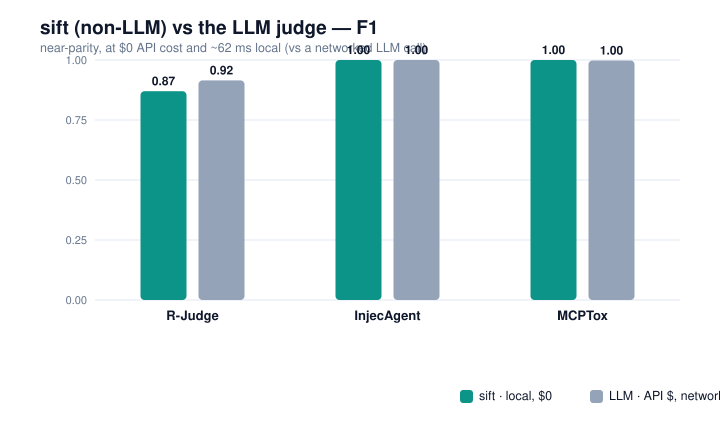
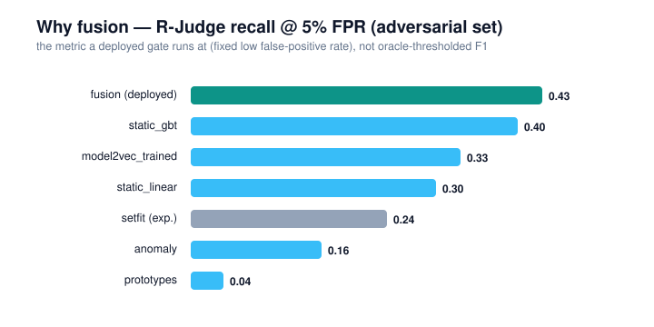

# sift — a non-LLM semantic sandbox for agent actions

`sift` classifies each agent tool-call **good / bad** without an LLM, as a drop-in alternative to
the ddbt LLM step-judge. It fuses a tiny **static embedding** (≤100 MB, not an SLM) with
**deterministic structural/taint features**, then decides **DENY / ASK / ALLOW** with a calibrated,
conformal band.

This is a **bake-off**: seven methods, one harness, ranked on a **shift/adversarial** test — not just
in-distribution — because semantic detectors look great in-dist and collapse under paraphrase/encoding
([arXiv:2504.11168](https://arxiv.org/abs/2504.11168)). See `CITATIONS.md` for every method's source.

## Why this shape

"Bad" factorises, and only part is semantic:
- **Semantic** (harm, secrecy, payload-sensitivity) → the embedding's job.
- **Structural / data-flow** (provenance, exfil-shape, scope, blast-radius) → deterministic code
  (`sift/features/structural.py`), optionally sourced from **ddbt's own** provenance + grant floor
  (`sift/features/ddbt_bridge.py`).

An embedding *cannot* tell whether a value was chosen by you or by an injection — that's origin, not
meaning — so the exfil guarantee lives in the structural layer, exactly as in ddbt.

## The seven methods

| # | method | encoder | head | note |
|---|--------|---------|------|------|
| 1 | `static_linear` | static | logistic | fast floor |
| 2 | `static_gbt` | static | grad-boosted trees | NemoGuard / XGBoost pattern |
| 3 | `prototypes` | static | nearest-centroid cosine | zero-shot, interpretable, extensible |
| 4 | `setfit` | MiniLM | contrastive + head | best few-shot accuracy |
| 5 | `model2vec_trained` | static | trainable head | trains the embedding, stays ~30 MB |
| 6 | `anomaly` | static | Mahalanobis to benign | catches novel attacks |
| 7 | `fusion` | static | GBT over `[emb ‖ structural]` | **the product** — ensemble defence |

## Run it

```bash
# offline, zero downloads (hashing encoder + sklearn methods 1,2,3,6,7):
uv run --directory sift --no-project --with numpy --with scikit-learn python train_all.py --encoder hashing

# the real static embedder (downloads potion-base-32M, ~30 MB):
uv run --directory sift --extra embed python train_all.py --encoder model2vec

# add the fine-tuners (SetFit, Model2Vec-trained):
uv run --directory sift --extra all python train_all.py --encoder model2vec
```

Output: a leaderboard ranked by **shift recall@5%FPR** and a JSON report in `sift/reports/`.

### The real benchmarks

```bash
./run_benches.sh                 # R-Judge + InjecAgent + MCPTox, real static encoder
./run_benches.sh hashing         # offline
```

Loads `bench/data/{rjudge,injecagent,mcptox}` from the parent repo with the **same label parsing as
the ddbt bench** (`sift/data/benches.py`), so numbers sit next to ddbt's LLM-judge results (R-Judge
F1 91.5% · InjecAgent 100% · MCPTox 99.8%). Each set is split train/test, plus an **adversarial-shift**
test (`synth.harden`: paraphrase + benign-framing + base64/ROT13/homoglyph/zero-width).

Two data-quality corrections vs a naive run:
- **MCPTox benign control** — the bench ships 485 poisoned vs only 8 clean descriptions, so FPR was
  unmeasurable. `sift/data/tool_descriptions.py` adds a balanced benign corpus **including hard
  negatives** (legitimate security/pre-authorization framing), so specificity is real.
- **Harder shift** — attacks are wrapped in benign business framing and encoded; a fraction of benign
  gets surface noise, so "clean surface ⇒ benign" isn't a free shortcut. `injecagent_prov` is the
  honest stressor: the *same* instruction labeled bad (arrived via a tool output) vs benign (the user
  asked for it) — only **provenance** separates them.

Metrics report `specificity@f1thr` and `n_benign` alongside F1, so an imbalanced set can't hide a
weak false-positive rate.

## Results — sift (non-LLM) vs the LLM judge

**The point: near-parity with the LLM, at $0 API cost and ~62 ms local.** Numbers are the
`potion-base-32M` run; "sift" is the deployed `fusion` method. F1 on each benchmark's unsafe/attack class.



| method | R-Judge F1 | InjecAgent | MCPTox | ~speed/query | cost | status |
|---|---|---|---|---|---|---|
| **fusion** | **0.87** | 1.00 | 1.00 | ~62 ms | **$0** | **deployed** |
| model2vec_trained | 0.89 | 1.00 | 1.00 | ~35 ms | $0 | comparator |
| static_linear | 0.88 | 1.00 | 0.99 | ~60 ms | $0 | comparator |
| static_gbt | 0.87 | 1.00 | 1.00 | ~60 ms | $0 | comparator |
| anomaly | 0.84 | 1.00 | 0.97 | ~60 ms | $0 | comparator |
| setfit | 0.83 | ~1.00 | 0.99 | ~180 ms | $0 | experimental |
| prototypes | 0.69 | 0.82 | 0.81 | ~60 ms | $0 | comparator |
| **LLM judge** (ddbt) | **0.915** | **1.00** | **0.998** | ~hundreds ms | **API $ + network** | flagged fallback |



**What the methods are** (all ≤100 MB, none an SLM): `static_linear`/`static_gbt` put a linear or
gradient-boosted head on a *frozen* potion-32M embedding; `prototypes` is zero-shot nearest-centroid
cosine to the malicious catalog (interpretable, one-line-extensible); `anomaly` scores distance from
the benign manifold (catches novel attacks); `model2vec_trained` fine-tunes the static embedding;
`setfit` (experimental, dropped) is a contrastive MiniLM fine-tune — it only ties the others but is
~3× slower to serve and minutes to train; **`fusion` (deployed)** concatenates the frozen embedding
with the deterministic **structural/taint** features and learns a GBT over both — the ensemble the
evasion literature recommends, and the one that keeps exfil detection exact even when the ML is fooled.
On InjecAgent and MCPTox sift matches the LLM; on R-Judge it trails 0.87 vs 0.915 — the honest gap,
closable with distillation. Charts regenerate via `python plot_results.py`.

## Deployed model & ddbt integration

**Chosen model: `fusion`** (frozen `potion-base-32M` + structural + GBT head). It trains fast (no
embedding fine-tune — just encode + fit), carries the structural/provenance layer a judge needs, and
is the most shift-robust. **SetFit is dropped** as a default — it needs a real fine-tune (~2.5 min/
benchmark) and only *ties* fusion, never beats it; it stays an opt-in bake-off comparator (`--slow`).

Train and save the deployable judge:
```bash
uv run --extra all python train_sift.py --encoder model2vec   # → models/sift_judge.joblib
```
ddbt then loads it as its **default decider** (LLM demoted to a flagged fallback via
`ddbt.json` `"judge": "llm"` or `DDBT_JUDGE=llm`). `sift.serve.SiftScorer` keeps the encoder warm for
fast per-call scoring; `ddbt/judge/sift_judge.py` maps a score to the engine's Verdict:
- **DENY** ← trained malicious risk (exfil/secrets/harm) — universal, from `data/taxonomy.py`.
- **ASK** ← a matched **workspace behavior** (a convention like "don't commit unasked" → confirm with a human, don't hard-block).
- **ALLOW** ← low risk, no rule matched.

## Workspace behaviors (`ddbt.json`)

"Bad" is split: **universal malicious** patterns are hardcoded in `data/taxonomy.py`; everything
**workspace-specific** lives in `ddbt.json` and needs no retraining:
```jsonc
"behaviors": {
  "deny": [
    "push to git or open a PR without me explicitly asking",   // natural language
    {"domain": "database", "category": "exfiltration", "text": "export table rows off the workspace"}
  ],
  "allow": ["run the test suite and report results"]
}
```
Each rule is matched by **salient keyword overlap** (≥2 shared content words) against the action's
tool+args — reliable and interpretable (the trained model carries the fuzzy/paraphrase axis). Adding
or editing a rule takes effect immediately. The deterministic allow/deny floor is the separate
`policy` block; `behaviors` is the semantic layer. Caveat: a rule only matches words that actually
appear in the tool call, so phrase it with terms the action uses (or use the taxonomy-dict form).

## Layout
```
sift/
  features/  text.py (decode+tag)  embed.py (encoders)  structural.py (taint)  ddbt_bridge.py
  data/      taxonomy.py (the "bad" catalog)  synth.py (corpus)  dataset.py
  methods/   embed_heads.py (1,2,3,6)  finetuned.py (4,5)  fusion.py (7)
  eval/      metrics.py  calibrate.py (Platt/isotonic + conformal)  harness.py
  train_all.py   eval_all.py
```

The seed corpus in `data/synth.py` is a placeholder to make the harness runnable today; real labels
come from the ddbt benches (R-Judge / InjecAgent / AgentDojo / MCPTox) and from distilling the ddbt
LLM judge — see the roadmap note in `synth.py`.
